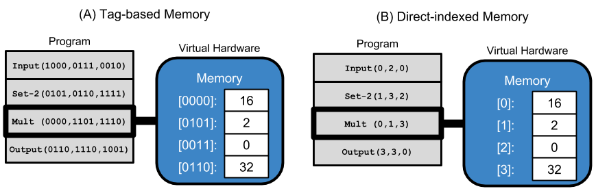

# Tag-accessed Memory for Genetic Programming

This repository is associated with our 2019 GECCO extended abstract submission,
Tag-accessed Memory for Genetic Programming.

**Navigation**

<!-- TOC -->

- [Project Overview](#project-overview)
  - [Tag-accessed Memory](#tag-accessed-memory)
  - [Contribution Authors](#contribution-authors)
- [Repository Guide](#repository-guide)
- [Running the Experiment](#running-the-experiment)

<!-- /TOC -->

## Project Overview

We present an early exploration of tag-accessed memory for genetic programming.

### Tag-accessed Memory

Tags are evolvable labels that give genetic programs a flexible mechanism for specification.
Tag-based naming schemes have been demonstrated for labeling and referencing program
modules [citations].

We continue to expand the use of tags in GP by incorporating tag-based referencing
into the memory model of a simple linear GP representation.
In this study, memory comprises 16 statically tagged memory registers, and instructions
use tag-based referencing to refer to positions in memory.
Programs our simple representation are linear sequences of instructions, and each
instruction has three tag-based arguments, which may modify the instruction's
behavior. Below, we provide a visual example, contrasting traditional direct-indexed
memory access and tag-based memory access.

In the example above, both programs have identical behavior: requesting input,
setting the second register to the terminal value '2', multiplying the input by
2, and outputting the result.

### Contribution Authors

- [Alexander Lalejini](lalejini.com)
- [Charles  Ofria](https://scholar.google.com/citations?user=nYLuKDAAAAAJ&hl=en)

## Repository Guide

- [analysis/](./analysis/)
  - Contains R scripts used for data analyses and generating graphs.
- [data/](./data/)
  - Contains raw data for preliminary and published experiments as well as the
    training and testing examples used for the programming synthesis benchmark 
    problems (taken from [Tom Helmuth's example repository](https://github.com/thelmuth/Program-Synthesis-Benchmark-Data)).
- [docs/](./docs/)
  - Contains miscellaneous documentation associated with this work.
- [experiment/](./experiment/)
  - Contains the source code (C++) for our simple linear GP representation and for
    running the experiments discussed in our contribution.
- [hpcc/](./hpcc/)
  - Contains scripts used to submit experiment jobs to MSU's HPCC.
- [media/](./media/)
  - Contains media (images) associated with this work.
- [scripts/](./scripts/)
  - Contains utility scripts used for managing experiments on the HPCC and for aggregating
    and manipulating experiment data.

## Running the Experiment

..todo..
