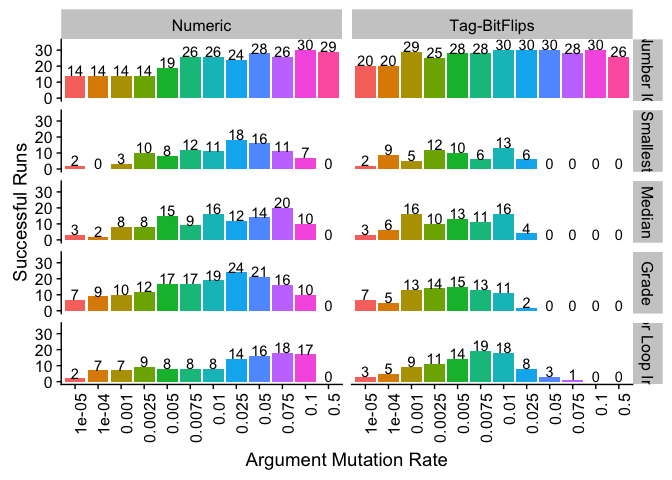
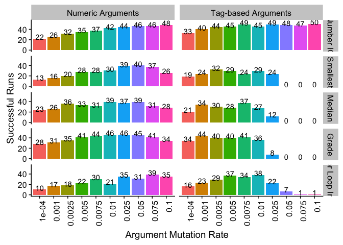

## Overview

Here, we analyze data from our tag-accessed memory for genetic programming experiments, comparing tag-accessed memory to more traditional, direct-indexed memory.

### Preliminary Experiments

We ran a set of preliminary experiments, applying our simple linear GP representation (with tag-based memory and direct-indexed memory) to 5 problems from the general program synthesis benchmark suite [cite]: for loop index, grade, median, small or large, and smallest.
We tried several tag-argument and numeric-argument mutation rates in our preliminary runs. 
For runs that used tag-based arguments, we tried the following per-bit tag-argument mutation rates: 0.001, 0.005, 0.01.
For runs that used numeric arguments, we tried the followign per-argument mutation rates: 0.001, 0.005, 0.01.
We ran these experiments for 1,000 generations.
For each problem, we looked at the proportion of runs (30 replicates per condition) that produced solutions.

### Final Experiments

In our second (final) set of runs, we ran for only 300 generations (as some of these problems are easy and performance saturates by 1,000 generations), and because results were fairly consistent across mutation rates (with 0.01 coming across as too high), we only used argument mutation rates of 0.005 (for both tag-based and numberic arguments).

## Analysis Setup

### Dependencies


```r
library(readr)
library(tidyr)
library(ggplot2)
library(plyr)
library(reshape2)
```

```
## 
## Attaching package: 'reshape2'
```

```
## The following object is masked from 'package:tidyr':
## 
##     smiths
```

```r
library(cowplot)
```

```
## 
## Attaching package: 'cowplot'
```

```
## The following object is masked from 'package:ggplot2':
## 
##     ggsave
```

```r
source("https://gist.githubusercontent.com/benmarwick/2a1bb0133ff568cbe28d/raw/fb53bd97121f7f9ce947837ef1a4c65a73bffb3f/geom_flat_violin.R")
```

```
## 
## Attaching package: 'dplyr'
```

```
## The following objects are masked from 'package:plyr':
## 
##     arrange, count, desc, failwith, id, mutate, rename, summarise,
##     summarize
```

```
## The following objects are masked from 'package:stats':
## 
##     filter, lag
```

```
## The following objects are masked from 'package:base':
## 
##     intersect, setdiff, setequal, union
```

### Load Data

Set path information.

```r
# Load data from preliminary runs.
prelim_u500_summary_loc <- "../data/prelim-results/min_programs__update_500__solutions_summary.csv"
prelim_u1000_summary_loc <- "../data/prelim-results/min_programs__update_1000__solutions_summary.csv"

# Load data for final experiment runs.
solutions_u300_data_loc <- "../data/exp/min_programs__update_300.csv"
solutions_u300_summary_data_loc <- "../data/exp/min_programs__update_300__solutions_summary.csv"
```

Load data in from file.

```r
prelim_u500_summary <- read.csv(prelim_u500_summary_loc, na.strings = "NONE")
prelim_u1000_summary <- read.csv(prelim_u1000_summary_loc, na.strings = "NONE")

prog_solutions_u300 <- read.csv(solutions_u300_data_loc, na.strings = "NONE")
prog_solutions_u300_summary <- read.csv(solutions_u300_summary_data_loc, na.strings = "NONE")
```

## Preliminary Results

Let's graph our preliminary results for each problem and mutation rate configuration after 500 generations of evolution.

<!-- -->

Let's graph our preliminary results for each problem and mutation rate configuration after 500 generations of evolution.


```
## Warning: Removed 1 rows containing missing values (geom_text).
```

<!-- -->
### Takeaways

Results are pretty robust across mutation rates. 0.01 seems like the worst for numeric arguments, so we won't go forward with it. Not much of a different between 0.001 and 0.005, we'll move forward with a rate of 0.005.

Small or large is pretty tough, even after 1,000 generations of evolution. We'll drop that problem and add the easiest problem in the benchmark suite, number IO.

After 1,000 generations problem performance for a few problems is saturated; thus, we'll limit evolution to just 300 generations.

## Experiment Results

For these results, Number IO was run for 100 generations (because it's such a trivial problem) and the others (median, smallest, for loop index, and grade) were run for 300 generations.

We ran 200 replicates (for statistical POWER) of each condition, comparing tag-based memory with direct-indexed memory across each of the five problems.


```
## Saving 7 x 5 in image
```

<!-- -->

From this, we see that tag-based memory consistently outperforms direct-indexed memory. But, are the differences significant? 

### Statistical Analysis

For each problem, we used Fisher's exact test to compare the success rates of runs using tag-based memory and runs using direct-indexed memory.

#### Problem - Number IO

Reminder, this is actually at generation 100 for number IO runs (despite the file being labeled generation 300).


```r
nio_data <- filter(prog_solutions_u300_summary, problem=="number-io" & arg_type!="Both" & arg_mut_rate=="0.005")
fisher.test(matrix(c(nio_data$solutions_found, nio_data$total_runs - nio_data$solutions_found), nrow=length(nio_data$solutions_found)))
```

```
## 
## 	Fisher's Exact Test for Count Data
## 
## data:  
## p-value < 2.2e-16
## alternative hypothesis: true odds ratio is not equal to 1
## 95 percent confidence interval:
##  0.003042058 0.101777565
## sample estimates:
## odds ratio 
## 0.02613986
```

#### Problem - Smallest


```r
prob_data <- filter(prog_solutions_u300_summary, problem=="smallest" & arg_type!="Both" & arg_mut_rate=="0.005")
fisher.test(matrix(c(prob_data$solutions_found, prob_data$total_runs - prob_data$solutions_found), nrow=length(prob_data$solutions_found)))
```

```
## 
## 	Fisher's Exact Test for Count Data
## 
## data:  
## p-value = 0.0007505
## alternative hypothesis: true odds ratio is not equal to 1
## 95 percent confidence interval:
##  0.3065287 0.7431869
## sample estimates:
## odds ratio 
##  0.4788245
```

#### Problem - Median


```r
prob_data <- filter(prog_solutions_u300_summary, problem=="median" & arg_type!="Both" & arg_mut_rate=="0.005")
fisher.test(matrix(c(prob_data$solutions_found, prob_data$total_runs - prob_data$solutions_found), nrow=length(prob_data$solutions_found)))
```

```
## 
## 	Fisher's Exact Test for Count Data
## 
## data:  
## p-value = 0.01204
## alternative hypothesis: true odds ratio is not equal to 1
## 95 percent confidence interval:
##  0.3894888 0.8955221
## sample estimates:
## odds ratio 
##  0.5914876
```

#### Problem - Grade


```r
prob_data <- filter(prog_solutions_u300_summary, problem=="grade" & arg_type!="Both" & arg_mut_rate=="0.005")
fisher.test(matrix(c(prob_data$solutions_found, prob_data$total_runs - prob_data$solutions_found), nrow=length(prob_data$solutions_found)))
```

```
## 
## 	Fisher's Exact Test for Count Data
## 
## data:  
## p-value = 0.004591
## alternative hypothesis: true odds ratio is not equal to 1
## 95 percent confidence interval:
##  0.3611841 0.8380632
## sample estimates:
## odds ratio 
##  0.5512133
```

#### Problem - For Loop Index


```r
prob_data <- filter(prog_solutions_u300_summary, problem=="for-loop-index" & arg_type!="Both" & arg_mut_rate=="0.005")
fisher.test(matrix(c(prob_data$solutions_found, prob_data$total_runs - prob_data$solutions_found), nrow=length(prob_data$solutions_found)))
```

```
## 
## 	Fisher's Exact Test for Count Data
## 
## data:  
## p-value = 0.0005227
## alternative hypothesis: true odds ratio is not equal to 1
## 95 percent confidence interval:
##  0.3131273 0.7352627
## sample estimates:
## odds ratio 
##  0.4809916
```
